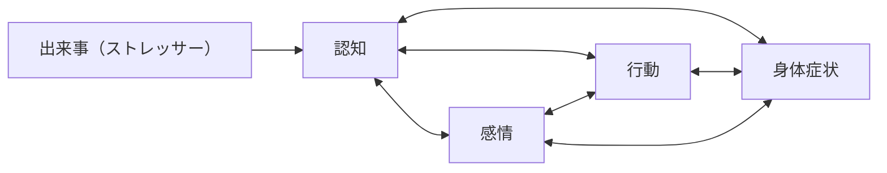

この記事は [GLOBIS Advent Calendar 2024](https://qiita.com/advent-calendar/2024/globis) 17日目の記事です。

筆者はエンジニアリングマネージャー、つまりは中間管理職として数年働いているのですが、権限の強さゆえの責任など、この立場ならではのストレスを感じる場面というのがあったりします。ここでは、そんな筆者が日常の範囲内において実践している、メンタルのコンディションを保っていくためのプラクティスをまとめてみます。

:::message
この記事で取り上げるのは、体調で言えば「ちょっと喉が痛いので加湿しよう / 鶏と野菜のスープを食べよう」というような、日常範囲でコンディションを保つための、個人による工夫です。重篤な症状の場合には専門機関の診断を受けましょう。
:::

## 中間管理職特有のストレス要因

会社員やエンジニア全般においても、誰だってストレスを感じる場面は当然ありますが、中間管理職特有の問題というのもあると思います。

時にマネージャーのアウトプットは明確な定義が難しいことがあります。[『HIGH OUTPUT MANAGEMENT』](https://www.hanmoto.com/bd/isbn/9784822255015) では `マネージャーのアウトプット＝自分の組織のアウトプット＋自分の影響力が及ぶ隣接諸組織のアウトプット` と書かれており、これは自分自身が直接アウトプットを出すことより、権限委譲やナッジングによって組織単位のアウトプットを最大化するべきだということを意味しています。

しかしナッジングは確かに行ったものの、実務に従事したのはチームメンバーである以上、チームの成果を本当に自分の成果と呼んでよいのか、悩む人も多いのではないかと思います。周囲から見ていると、そのマネージャーの活躍は明らかなのに、自身ではそのことを肯定できないような状態は **詐欺師症候群 (Impostor syndrome)** と呼ばれ、抑うつ的な気分に繋がることもあります。

またその名が指す通り、中間管理職とは階層の狭間に存在し、経営層と現場の意見との間で板挟みにもなりがちです。昨今のITエンジニアリングの現場では、強固な階層構造が存在しない場合も多いとは思いますが、意思決定する場面が多い中間管理職は、人間関係以外でもなにかしら板挟み状態に陥ることも多かったりします。

## ストレスの発生メカニズムを知る

何か課題に対処していくには、まずその課題が生まれるメカニズムを知るべきでしょう。

心理療法の1つである認知行動療法のなかでは上図^[『Newton別冊　メンタルの取扱説明書』 p.80-81を参考に作成。]のようなモデルが扱われており、ストレスの原因になる出来事（ストレッサー）に対する認知が、行動や感情、身体症状と密接に関わっているとしています。「悲しい」「つらい」といった感情自体をコントロールすることは難しいものの、出来事をどう捉えるかという認知や、嫌な出来事があった際の行動を変えることで、結果的に感情も変化させる、というのが認知行動療法の理論です。

認知行動療法を本格的に取り入れなくとも、 **感情自体ではなく認知や行動にフォーカスする** という基本の考え方を知っておくことで、日常のなかで対処ができそうです。

## 考えていることを書き出して客観化してみる

認知や行動にフォーカスすると言っても、抑うつ的な感情やストレスに苛まれているときにはなかなか自分がどう認知しているのかには気付けなかったりします。頭のなかが情報や思考で溢れかえったときは、とりあえず考えていることを書き出してみることをよくやります。すると意外に対処が単純だったり、自分の認知に誤りがあると気付くきっかけになったりします。

ジャーナリングと呼ばれる手法に近いものかと思いますが、毎日定期的にやっているわけではなく、任意のタイミングで行っています。また、月に1回は30分程度かけて、思考を書き出す機会を必ず設けるようにしています。最近は [Logseq](https://logseq.com/) のようにJournal（日誌）を付けることに特化したツールも多いので、こういったものも活用できそうです。

まず何事においても書き出してみて、俯瞰可能にすることが出発点になります。

## 風呂でとことん思考と感情を煮詰めてみる

一方で書く気分にすらならない、というときもあるかもしれません。嫌な感情を書き下すのは、それ自体がストレスにも成り得ます。

そういったときは頭のなかでひたすら煮詰めることをやるときもあります。スマホ、PCなどがあると思考が脇に逸れてしまうので、それらが一切ない環境で一旦思考を極限まで「煮詰め」ます。強制的にそういった環境をつくるため、例えばコーヒー豆を挽いてコーヒーを淹れる、散歩をする、もっと時間がある場合は風呂に入ったり銭湯に行くという手段もあります。筆者はサウナよりもっぱら温泉派ですが、 [「サウナは、脳のガベージコレクション」](https://and-engineer.com/articles/XoSQwRAAACMAmQTN) という言葉には共感します。

日常の範囲内のストレスであれば、それほど長時間感情を強く害するわけでもないので、風呂に入っているうちに徐々に思考と感情が整理される場合が多いです。その後に改めて書き出しを行い、最終的な思考整理を行います。

この手法は [『リーダーの作法』](https://www.oreilly.co.jp/books/9784873119892/) に「アンチフロー」という名前で掲載されています。高い集中状態を示すフローの逆（アンチ）ということで、ひたすら脳内で思考を発散させることでインスピレーションを得られるとしています。

## 認知の枠組みを手に入れる

先の「マネージャーのアウトプット」の例では、組織のアウトプットを自身の成果に結びつけることの難しさが不安に繋がると考えました。この「自身の成果 = 組織のアウトプットと考えると、自身の成果を評価しづらい」という認知を変えてみましょう。

これは弊社グロービスCTOの [グロービスの技術広報の歩み - Speaker Deck](https://speakerdeck.com/sue738/gurobisunoji-shu-guang-bao-nobu-mi?slide=20) というスライドからの抜粋です^[ZennのSpeakerDeck埋め込みは「ページ指定」での埋め込みに対応していないため、スクリーンショットで抜粋しています。]。成果の振り返りとして、組織のアウトプットという、自分からは間接的な結果だけを見てしまうとなかなか難しくとも、それに至るまでに自分はどういった行動を取ったのか、そのひとつひとつの行動の直接的な成果は累積するとどうなるのか、などと考えていくことで、より高い解像度で自身の貢献を認識することができそうです。

このような考え方のフレームワークを増やしていくことで、自身の認知を変えるきっかけとして活用できます。

## 気にする必要のないことは手放す

感情はコントロールできないから認知や行動をコントロールする、という考え方を応用すると、自身が影響を及ぼせないものには執着しない、という考え方に一般化できます。メンバーから離職の意向を告げられたとして、あれこれ悩んでも他人の考えを変えるのは容易ではありません。円高によるクラウドコスト増は苦しいですが、一介のエンジニアはドル円相場には介入できません。

このような考え方は、認知行動療法との繋がりがあるとされるストア哲学や、有名な自己啓発書の『7つの習慣』における「関心の輪 影響の輪」、 [ニーバーの祈り](https://ja.wikipedia.org/wiki/%E3%83%8B%E3%83%BC%E3%83%90%E3%83%BC%E3%81%AE%E7%A5%88%E3%82%8A) など、さまざまな形で語られてきています。

### 気にしなくていいものを共通認識にする

とはいえ、関心を手放そうと思えば手放せるのであれば苦労はしません。

組織的な課題の場合に自分がよくやるのは、そのことについて気にしない、いわば放置することを他のメンバーと共通認識にすることです。これだけで楽になることも多いです。

### できることはやっておく

[『エンジニアリングマネージャーのしごと』](https://www.hanmoto.com/bd/isbn/9784873119946) では、コントロールできる / できないに二分するのではなく、その間に「ある程度コントロールできるもの」があるとしています。離職予定者の心そのものはコントロールできないものの、しっかりヒアリングをして向き合うなど、可能な範囲で関心を払うことも一方では重要です。人事を尽くして天命を待つ、に近いかもしれません。

## 破滅的な行動をしない

嫌な気分になったときに、ついやりがちな行動があると思います。やけ食い、やけ酒などが代表的かもしれません。それでストレスが緩和されるなら良いのですが、さらにストレスフルになったり、二日酔いや消化不良といった別のストレス源になってしまうこともあります。

三十代半ばも過ぎると、自分にとってどういった行動が「破滅的」か、どういう状態が続くとまずいのかは経験から理解しているので、極力それを避けるよう努力しています。例としては「机の上が散らかりがちになる」というのがあるので、なるべく毎日机上を整理するようにしたり、つい高カロリーなものを外食、中食しがちになるのをこらえて、簡単でもいいから家で食事を調えられるよう、冷凍食品や保存食を充実させたりしています。

## ツールを使ってみる

認知行動療法は専門家による対話形式で行う心理療法が基本のようですが、最近では自分自身で実施するための書籍やツールも多くあります。

https://www.awarefy.com/app

Awarefyはそのひとつで、アプリを使って認知行動療法の支援を受けられます。例えば先述した「書き出し」は我流で行っていますが、より効果的に行うにあたっては、認知行動療法に適した形で思考を整理する「コラム法」と呼ばれるメソッドがあり、Awarefyはこれをサポートしてくれたりします。一部有料にはなるものの、無料で使える機能も多くあります。

筆者は現在日常的に活用してはいませんが、以前習慣的に使っていました。認知行動療法を知る入口になったのも、このアプリです。

## 最後に

ここで紹介したのは極一部ですし、より科学的根拠の強い手法などは他にさまざまあります。筆者は当然ながらこの分野の専門家ではありませんが、近年は多くの情報が巷に溢れており、自分なりに読み解き、実践して、その結果に基づきまた別の実践を試したりすることができます。付け焼き刃であることに注意は必要ですが、一種、自身に対するハックのような感覚に近いかもしれません。

筆者がこれまでに触れてきた文献を紹介して、この記事を締めたいと思います。

### Newton別冊　メンタルの取扱説明書

https://www.hanmoto.com/bd/isbn/9784315528190

Newtonということで非常に読みやすいです。認知行動療法についてのみならず、やる気を上げる方法、そもそも強いメンタルを作る方法などについても掲載されています。

### 一番大切なのに誰も教えてくれない　メンタルマネジメント大全

https://www.hanmoto.com/bd/isbn/9784309300245

自己啓発本のようなタイトルですが、多くの論文などに基づいて書かれた本です。「大切なものを失ったとき」「自信をなくしているとき」など、ケース別に逆引き的に使えるようになっています。

### 迷いを断つためのストア哲学

https://www.hanmoto.com/bd/isbn/9784152098528

認知行動療法と繋がりが深いとされる、ストア哲学について知りたくて読みました。哲学は「認知」の枠組みを増やすきっかけとしてもおすすめです。
