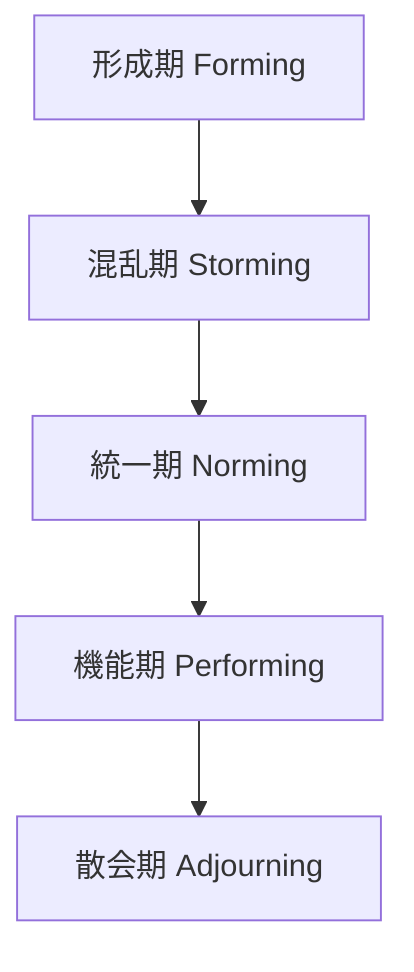

今月はじめに [SREのリアル｜組織フェーズに合わせたSREの役割とは](https://globis.connpass.com/event/337033/) というイベントにて、 [責務で考える組織と 第三世代のSRE](https://speakerdeck.com/globis_gdp/ze-wu-dekao-eruzu-zhi-to-di-san-shi-dai-nosre) と題する発表を行いました。その中で、『[チームトポロジー](https://www.hanmoto.com/bd/isbn/9784820729631)』Chapter3より、次の文を引用しました。

> 最近の研究では、このモデル（引用注：タックマンモデルのこと）が必ずしも正しくないことがわかってきた。チームが存続している間、混乱はずっと続くというものだ。

引用に付随して「タックマンモデルが描いた統一や安定はやってこない（かも）」とスライドには記載したのですが、その後引用文中で言われている「最近の研究」を改めて紐解くと、やや誤った解釈だったようにも思えてきました。この記事ではスライドへの補足として、タックマンモデルが「正しくない」とはどういうことか、混乱はずっと続くとはどういう状態なのかについて見ていきます。

なお、イベントの様子は [Toggeter](https://togetter.com/li/2478156) にもまとまっているので、よろしければ合わせてご覧ください。

## タックマンモデルとは

そもそものタックマンモデルとは何か？という話ですが、チームビルドの過程を5段階のプロセスとしてモデル化したものです^[[チームビルディングとは？その重要性と目的、実践方法｜グロービスキャリアノート](https://mba.globis.ac.jp/careernote/1483.html)]。

チームは形成された後、メンバー間の意見が衝突したりする混乱期を経ますが、その後チームビジョンなどが統一される過程を経て、最終的にはパフォーマンスを発揮して機能できるようになっていく、というものです。

このモデルはBruce W. Tuckmanが1965年^[[Developmental sequence in small groups.](https://psycnet.apa.org/record/1965-12187-001)]と1977年^[[Stages of small-group development revisited.](https://psycnet.apa.org/record/1978-31706-001)]にそれぞれ発表した論文が元になっています。すでに理論化から半世紀近く経っているわけですが、今日でも多くのビジネス書などで引用されるモデルです。SREに身近なところですと、『[サイトリライアビリティワークブック](https://www.hanmoto.com/bd/isbn/9784873119137)』の20章「SREチームのライフサイクル」でも、タックマンモデルに則った形でチームライフサイクルが説明されています。

## 混乱はずっと続く、とはどういう状態か

冒頭で引用したように、『チームトポロジー』においては、このモデルは「必ずしも正しくない」とされています。その根拠として引かれているのが、Pamela Knightの [Acquisition Community Team Dynamics: The Tuckman Model vs. the DAU Model](https://calhoun.nps.edu/entities/publication/54ef585b-0801-4343-a7f5-e060349cc3c4) という論文です。この論文では、米国防総省において321のチームを対象に調査が行われており、その結果タックマンモデルに従う変化を見せたのは全体の2%に過ぎなかったとされています。

具体的な相違点は、一過性の時期としての「混乱期」が見られなかったことです。チームの混乱（Storming）は、とある時期に訪れていずれ克服されるようなものではなく、低いレベルで持続的に見られたとされています。

ここで言う低いレベルの混乱とは、チームを二分するようなネガティブな意見対立ではなく、各メンバーの積極的な意思表明による建設的議論を指しています。日本語のタックマンモデルでは「混乱期」と称されますが、幾度か書いてきたように原文では "Storming" であり、日本語の「混乱」からイメージされがちな "Chaos" や "Confusing" を思い浮かべてしまうと、ニュアンスが異なるかもしれません。Knightの論文では "Storming (e.g., cooperative brainstorming)" と書かれてもいるのですが、日本語の「ブレインストーミング」のように、闊達に多くの意見が交わされているような状態がイメージとして近いのだと思います。

また、全体の77%のチームにおいては、Forming、Norming、Performingの3段階による変化が見られたとされ、論文中ではこれをDAU^[Pamela Knightが論文発表時に所属していたDefense Acquisition Universityの略。]モデルと名付けています。チームの全体的な状態として、Norming（統一、標準化）からPerforming（機能、価値発揮）へと次第に変化していくとした点はTuckmanと同様です。この変化と並行して、常に何らかのStormingな状態が続いていく、としたのがKnightの論文です。

## タックマンモデルは「必ずしも」正しくない

『チームトポロジー』でのタックマンモデルへの言及は、冒頭に引いた一文のみであり、コラムのような箇所での記述ということもあって、あまり詳細には入り込んでいません。「混乱はずっと続く」と言われると、日本語のニュアンスもあってかなりハードな状態を思い浮かべそうにもなりますが、実際には現代の組織ではよくある変化の激しさに近いものではないかと捉えています。

発表から長い時間を経ているだけあり、タックマンモデルへの反証はKnightの論文以外でも随所で見られます。例えば [The Tuckman’s model for team is overrated. Here’s why. | by Bao Lan Nguyen | Sprynkl | Medium](https://medium.com/sprynkl/the-tuckmans-model-for-team-is-overrated-here-s-why-402bb95e2536) では、チームは必ずしもタックマンモデルのような一方向的な変化をするわけではないとされています。ただ、様々な組織が一様に同じモデルに則ったプロセスを経るわけではないのは、ある種自明でもあり、タックマンモデルは **「必ずしも」** 正しくないという表現は非常に的を得ていると感じます。
